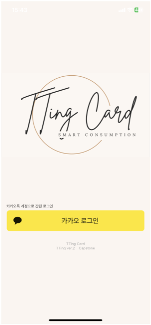
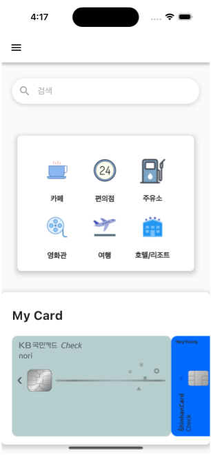
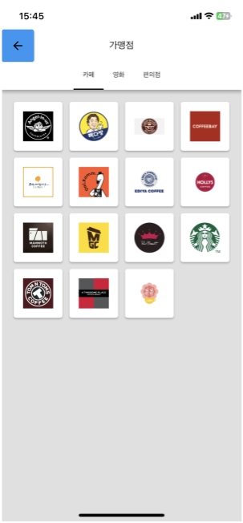
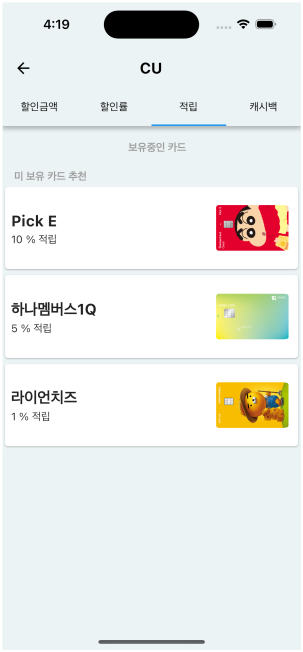
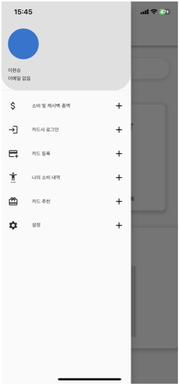
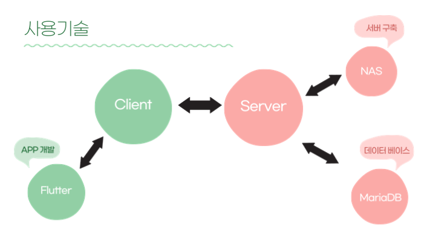

# TTingBank

<h2> TTingBank</h2>
.  내가 기존에 보유한 상품으로 최대 혜택을 받을 수 없을까?🍀

## 목차
  - [개요](#개요) 
  - [설명](#설명)

## 개요
- 프로젝트 이름: TTingBank
- 프로젝트 지속기간: 2024.03-2024.06
- 개발 엔진 및 언어: flutter && node.js
- 멤버: 고현석, 서상윤, 김명준, 이현승, 이경록, 손명현

## 설명
|!|||||
|:---:|:---:|:---:|:---:|:---:|:---:|
|로그인 화면|메인 화면|스토어 리스트|카드 추천 페이지|메뉴 화면|사용 기술

스마트한 소비를 위한 카드 추천을 목표로 TTingBank라는 앱을 제작했습니다. 
- 로그인 화면  
사용자는 카카오 로그인으로 접속합니다.
- 메인화면 
사용자는 가맹점 분류를 선택할 수 있고, 은행 로그인을 통해 계정을 연동하고, 사용자가 갖고있는 카드를 등록하면 아래의 My Card에 등록한 카드가 나오게 됩니다.
- 스토어 리스트 
가맹점을 선택하여 들어갈 수 있습니다.
- 카드 추천 페이지 
사용자가 가맹점을 선택하여 들어갈 시, 본인이 갖고있는 카드 중에 가장 좋은 혜택을 가진 카드가 맨 위 상단에 나오게 됩니다.
- 메뉴 화면 
메뉴에는 소비 및 캐쉬백 총액, 카드사 로그인, 카드 등록, 나의 소비 내역, 카드 추천, 설정 등이 있습니다.
- 사용 기술 
Flutter를 통해 앱을 개발했고, 서버는 Nas를 사용하였습니다. maraiDB를 데이터베이스로 사용했고 이것의 관리는 phpmyadmin으로 진행했습니다.